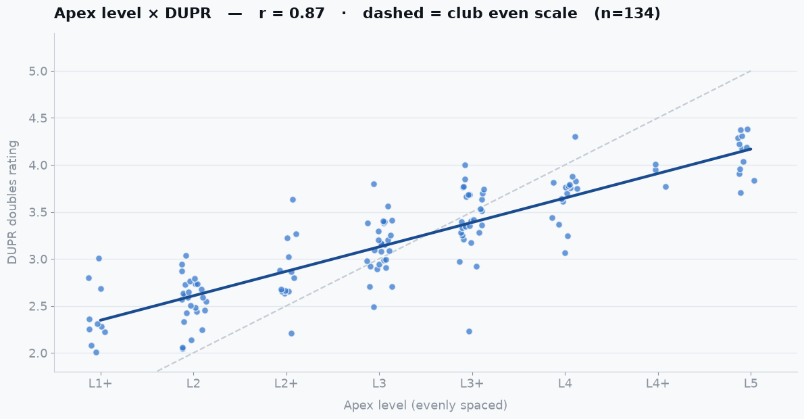

# Apex Level × DUPR

**A courtside report comparing [Apex Pickleball Clubs](https://apexpbclubs.podplay.app/) in-house skill levels (Cedar Park, TX) against players' real DUPR doubles ratings.**

**Live page:** https://chriswiles.github.io/apex-level-dupr/

## What it is

Every Apex player is placed at an in-house **level** (1B, 1+, 2, 2+, 3, 3+, 4, 4+, 5) — a coach's call, loosely aimed at DUPR. This page sets each player's Apex level against their **actual DUPR doubles rating** to see how the club's ladder lines up with the global scale.

The page is a single self-contained `index.html` — all data is embedded inline, no server or build step. It has:

- A **reliability filter** (All rated / Reliable ≥30 / Established ≥60) and an **Active (played within 1 year)** toggle that together live-recompute every chart and stat. DUPR reliability is DUPR's own 0–100 confidence score for a rating.
- **Correlation scatter** — DUPR against the Apex ladder, drawn as an **evenly spaced** progression (the "+" levels sit halfway to the next round level, so L3+ is treated as 3.5, not 3.9). Shows the real trend plus the club's even-scale reference.
- **Distribution by level** — box-and-whisker of the DUPR ratings inside each Apex level, with a marker for the level's even-scale spot.
- **The gap** — average difference between a level's real DUPR and its even-scale mark; it slides smoothly from positive at the bottom to negative at the top.
- **Standouts** — players furthest from the **average DUPR of others at their own level** (not from the level number), in both directions.
- A **sortable data table** of every matched player.

Light/dark themes, hover tooltips, keyboard-focusable, works on mobile.

## What it found

- Apex level and real DUPR are **strongly correlated (r ≈ 0.87)** — the ladder ranks players well.
- But the club's scale is **stretched ~1.9× wider than DUPR**: one point on the even scale is worth only about **+0.5 DUPR**, and one rung up the ladder (e.g. L3 → L3+) is about **+0.26 DUPR**.
- Because of that stretch, low levels sit **above** their even-scale mark and high levels **below** — Level 5 players run about **0.8 DUPR under** the 5.0 mark. This is a scale-calibration effect, not misplaced players; the levels are a coach's ladder, not DUPR numbers.

## Data & method

`data/player-level-vs-dupr.csv` is the full matched dataset; `data/player-level-vs-dupr.md` is a longer write-up of how names were matched to DUPR accounts (Austin-metro disambiguation, reliability, last-match dates) and which players couldn't be matched.

- **Apex level** comes from the club's public PodPlay session catalog (each session carries a level band); a player's figure is the average of the sessions they attended.
- **DUPR rating** is a live lookup of each player's DUPR doubles rating, biased to the Cedar Park / Austin area for name disambiguation. Only **doubles** ratings are charted; singles and unrated (NR) accounts are set aside.

## Notes

Not affiliated with Apex Pickleball Clubs or DUPR. Apex level is a coach's placement, not a DUPR clone — a loose guide by design, so "runs hot" describes the mapping, not the club. DUPR is a live snapshot; some accounts are stale (see the last-match dates in the data).
